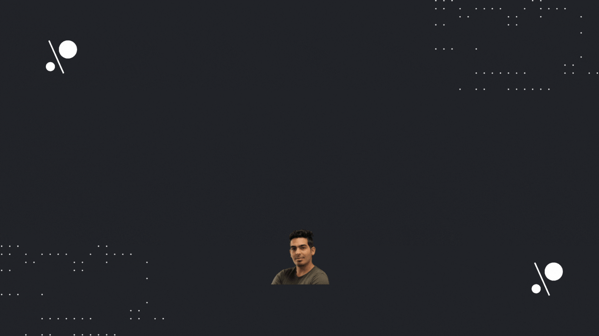

 

<h1 align="Center" id="macropower-title">:wave: Hey there! I'm Jawher MANSOUR</h1>
<h3 align="Center"> UAV pilot | PCB Designer | Maker | Electronic enthusiast </h3>
<h3 align="Center"> ❤️ who loves reverse Engineering things ❤️  </h3>
<h5 align="Center">-Everything here is made with coffee and computers -  </h5>

Hi, I'm [Jawher MANSOUR](https://jawher-mansour.github.io/), a Dynamic and sociable Young motivated PCB designer and UAV pilot from Tunisia 🇹🇳 . who is passionate about technological innovations, especially IoT, robotics, embedded communication protocols (CAN, I2C, SPI, USART), and reverse engineering.

My passion for PCB design lies in dreaming up ideas and making them come true with an elegant layout. I take great care in the experience, Schematic, and PCB quality of the things I build.

I am also an open-source enthusiast and maintainer. I learned a lot from the open-source community and I love how collaboration and knowledge sharing happened through open-source.

## Experience:
Actually, I'm a teacher at the Military Academy of Tunisia :tunisia: , and also the co-founder and CEO of [LAB619 Engineering & Consulting Services](https://lab619.tn/).
I'm a professional trainer and mentor who is very familiar with the LoRa, Wi-Fi, and GPRS technology when it comes to IoT.
I held a UAV pilot certificate from [Silla University](https://en.silla.ac.kr/en/) in South Korea :kr: .

I've spent most of my time as a PCB designer and firmware working with the following tools/technologies:
- Altium Designer
- Ltspice
- Kicad EDA
- GitHub
- LoRa
- GPRS
- WiFi
- Drones (M600,M200,Mavic and custom built drones).
- MCUs(AVR,ARM,PIC)

 ## ⚙️ &nbsp;GitHub Analytics

<a href="https://github.com/jawher-Mansour">
  
  &nbsp;     
</a> 

    
  
  ## if you like what i do, maybe consider buying me a coffee/tea 🥺👉👈

	

## Where to find me:
Feel free to reach out, whether for a freelancing job or if you have any questions :
<!-- Social icons section -->

  
  &#8287;&#8287;&#8287;&#8287;&#8287;
  
  &#8287;&#8287;&#8287;&#8287;&#8287;
  
  &#8287;&#8287;&#8287;&#8287;&#8287;
  

	<strong>Consider giving my work a :star: to show some :heart:</strong>

   <i>People who are really serious about software should make their own hardware.</i>
    
   <i>You miss 100% of the shots you don't take.</i>
    
 
